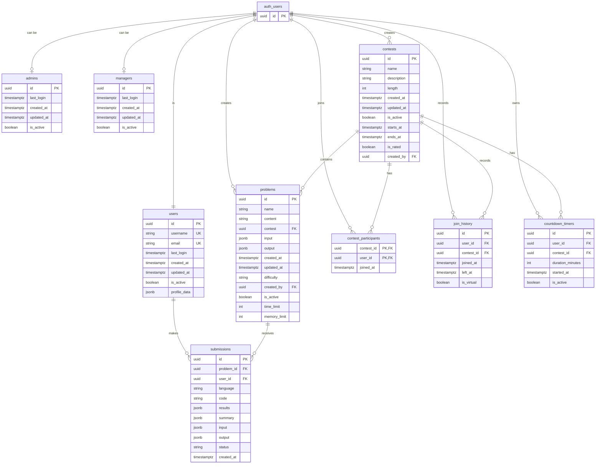

```mermaid
erDiagram
    %% Auth Users (Supabase Built-in)
    auth_users {
        uuid id PK
    }

    %% Public Users
    users {
        uuid id PK
        string username UK
        string email UK
        timestamptz last_login
        timestamptz created_at
        timestamptz updated_at
        boolean is_active
        jsonb profile_data
    }

    %% Roles (Admins & Managers)
    admins {
        uuid id PK
        timestamptz last_login
        timestamptz created_at
        timestamptz updated_at
        boolean is_active
    }

    managers {
        uuid id PK
        timestamptz last_login
        timestamptz created_at
        timestamptz updated_at
        boolean is_active
    }

    %% Contests
    contests {
        uuid id PK
        string name
        string description
        int length
        timestamptz created_at
        timestamptz updated_at
        boolean is_active
        timestamptz starts_at
        timestamptz ends_at
        boolean is_rated
        uuid created_by FK
    }

    %% Problems
    problems {
        uuid id PK
        string name
        string content
        uuid contest FK
        jsonb input
        jsonb output
        timestamptz created_at
        timestamptz updated_at
        string difficulty
        uuid created_by FK
        boolean is_active
        int time_limit
        int memory_limit
    }

    %% Submissions
    submissions {
        uuid id PK
        uuid problem_id FK
        uuid user_id FK
        string language
        string code
        jsonb results
        jsonb summary
        jsonb input
        jsonb output
        string status
        timestamptz created_at
    }

    %% Contest Participation & Timers
    contest_participants {
        uuid contest_id PK, FK
        uuid user_id PK, FK
        timestamptz joined_at
    }

    join_history {
        uuid id PK
        uuid user_id FK
        uuid contest_id FK
        timestamptz joined_at
        timestamptz left_at
        boolean is_virtual
    }

    countdown_timers {
        uuid id PK
        uuid user_id FK
        uuid contest_id FK
        int duration_minutes
        timestamptz started_at
        boolean is_active
    }

    %% Relationships
    auth_users ||--|| users : "is"
    auth_users ||--o| admins : "can be"
    auth_users ||--o| managers : "can be"

    auth_users ||--o{ contests : "creates"
    auth_users ||--o{ problems : "creates"

    auth_users ||--o{ contest_participants : "joins"
    contests ||--o{ contest_participants : "has"

    auth_users ||--o{ join_history : "records"
    contests ||--o{ join_history : "records"

    auth_users ||--o{ countdown_timers : "owns"
    contests ||--o{ countdown_timers : "has"

    contests ||--o{ problems : "contains"

    %% Note: submissions table foreign keys to users and problems weren't explicitly documented as DB constraints in the dump, but logically:
    users ||--o{ submissions : "makes"
    problems ||--o{ submissions : "receives"
```
