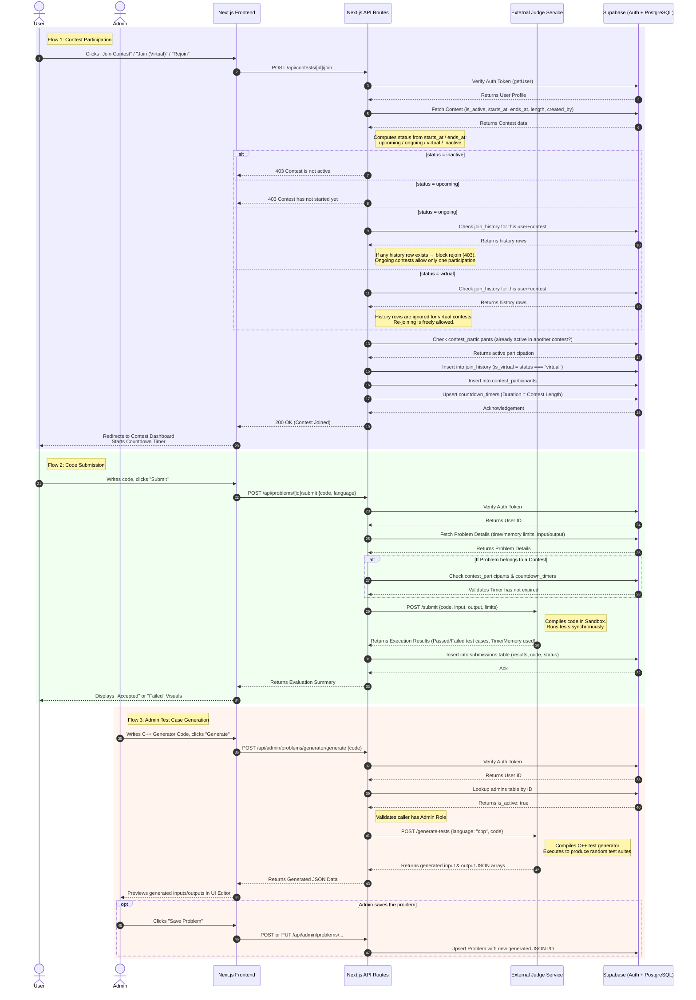

```mermaid
sequenceDiagram
    autonumber

    actor User
    actor Admin
    participant UI as Next.js Frontend
    participant API as Next.js API Routes
    participant Judge as External Judge Service
    participant DB as Supabase (Auth + PostgreSQL)

    %% --- 1. Contest Participation Flow ---
    rect rgb(238, 238, 255)
    note right of User: Flow 1: Contest Participation
    User->>UI: Clicks "Join Contest" / "Join (Virtual)" / "Rejoin"
    UI->>API: POST /api/contests/[id]/join
    API->>DB: Verify Auth Token (getUser)
    DB-->>API: Returns User Profile

    API->>DB: Fetch Contest (is_active, starts_at, ends_at, length, created_by)
    DB-->>API: Returns Contest data
    note right of API: Computes status from starts_at / ends_at:<br/>upcoming / ongoing / virtual / inactive

    alt status = inactive
        API-->>UI: 403 Contest is not active
    else status = upcoming
        API-->>UI: 403 Contest has not started yet
    else status = ongoing
        API->>DB: Check join_history for this user+contest
        DB-->>API: Returns history rows
        note right of API: If any history row exists → block rejoin (403).<br/>Ongoing contests allow only one participation.
    else status = virtual
        API->>DB: Check join_history for this user+contest
        DB-->>API: Returns history rows
        note right of API: History rows are ignored for virtual contests.<br/>Re-joining is freely allowed.
    end

    API->>DB: Check contest_participants (already active in another contest?)
    DB-->>API: Returns active participation

    API->>DB: Insert into join_history (is_virtual = status === "virtual")
    API->>DB: Insert into contest_participants
    API->>DB: Upsert countdown_timers (Duration = Contest Length)
    DB-->>API: Acknowledgement
    API-->>UI: 200 OK (Contest Joined)
    UI-->>User: Redirects to Contest Dashboard<br/>Starts Countdown Timer
    end

    %% --- 2. User Code Submission Flow ---
    rect rgb(240, 255, 240)
    note right of User: Flow 2: Code Submission
    User->>UI: Writes code, clicks "Submit"
    UI->>API: POST /api/problems/[id]/submit {code, language}
    API->>DB: Verify Auth Token
    DB-->>API: Returns User ID

    API->>DB: Fetch Problem Details (time/memory limits, input/output)
    DB-->>API: Returns Problem Details

    alt If Problem belongs to a Contest
        API->>DB: Check contest_participants & countdown_timers
        DB-->>API: Validates Timer has not expired
    end

    API->>Judge: POST /submit {code, input, output, limits}
    note right of Judge: Compiles code in Sandbox.<br/>Runs tests synchronously.
    Judge-->>API: Returns Execution Results (Passed/Failed test cases, Time/Memory used)

    API->>DB: Insert into submissions table (results, code, status)
    DB-->>API: Ack
    API-->>UI: Returns Evaluation Summary
    UI-->>User: Displays "Accepted" or "Failed" Visuals
    end

    %% --- 3. Admin Generator Submission Flow ---
    rect rgb(255, 245, 238)
    note right of Admin: Flow 3: Admin Test Case Generation
    Admin->>UI: Writes C++ Generator Code, clicks "Generate"
    UI->>API: POST /api/admin/problems/generator/generate {code}

    API->>DB: Verify Auth Token
    DB-->>API: Returns User ID

    API->>DB: Lookup admins table by ID
    DB-->>API: Returns is_active: true
    note right of API: Validates caller has Admin Role

    API->>Judge: POST /generate-tests {language: "cpp", code}
    note right of Judge: Compiles C++ test generator.<br/>Executes to produce random test suites.
    Judge-->>API: Returns generated input & output JSON arrays

    API-->>UI: Returns Generated JSON Data
    UI-->>Admin: Previews generated inputs/outputs in UI Editor

    %% Implicit step: saving the problem
    opt Admin saves the problem
        Admin->>UI: Clicks "Save Problem"
        UI->>API: POST or PUT /api/admin/problems/...
        API->>DB: Upsert Problem with new generated JSON I/O
    end
    end
```
